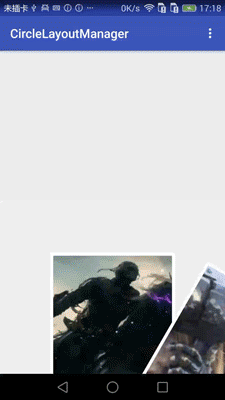
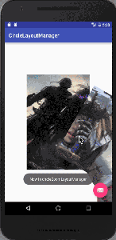
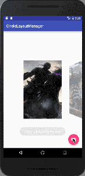

Android Circle and Zoom LayoutManager for Recyclerview
======================

## Examples
  

####Springback mode

 

## Description

Circle LayoutManager arrays items into a circle.
It uses a SparseArray to record every child's rotate degree. 
Then layout all of children by calculating their x and y position according to their current degree.
When scrolling it will transform the swipe distance into offset degree and re-layout all the children. 
Also it will remove the view which is out of range for reusing. 

ScrollZoomLayoputManager will zoom the center view and it will handle the scale while scrolling.

## Usage
#### CircleLayoutManager
```Java
circleLayoutManager = new CircleLayoutManager(context);
recyclerView.setLayoutManager(circleLayoutManager);
```

#### ScrollZoomLayoutManager
```Java
scrollZoomLayoutManager = new ScrollZoomLayoutManager(context,space);
recyclerView.setLayoutManager(scrollZoomLayoutManager);
```

####To enable springback

```Java
recyclerView.addOnScrollListener(new CenterScrollListener());
```

## API

```JAVA
         0
         |
         |
         |
270------ -------90 
         |
         |
         |
        180

//set the visable range of degrees
setDegreeRangeWillShow(int min,int max)

//set the radius
setRadius(int mRadius)

//set interval angle for each children
setIntervalAngle(int intervalAngle)

//set first child rotate
setFirstChildRotate(int firstChildRotate)

//set content x point in parent
setContentOffsetX(int contentOffsetX)

//set content y point in parent
setContentOffsetY(int contentOffsetY)
```

## License ##
    Copyright 2016 shenruochuan
    Licensed under the Apache License, Version 2.0 (the "License");
    you may not use this file except in compliance with the License.
    You may obtain a copy of the License at

    http://www.apache.org/licenses/LICENSE-2.0

    Unless required by applicable law or agreed to in writing, software
    distributed under the License is distributed on an "AS IS" BASIS,
    WITHOUT WARRANTIES OR CONDITIONS OF ANY KIND, either express or implied.
    See the License for the specific language governing permissions and
    limitations under the License.