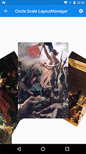

# ViewPager-LayoutManager [ ](https://bintray.com/leochuan/maven/viewpager-layout-manager/_latestVersion) 

**English** | [中文](README_ZH.md)


VPLM is a `ViewPager` like `LayoutManager` which implements some common animations. If you need some other effects feel free to raise an issue or PR.

     

## Customzie


Each `layoutmanager` has bunch of different properties to customize.

Such as:
* radius
* scroll speed
* space
* orientation

Run the demo to see more details.

## Infinite Scroll


## Auto Center

You can make the target view stop right at center every time you swipe or drag by:
```java
// work exactly same as LinearSnapHelper.
new CenterSnapHelper().attachToRecyclerView(recyclerView);
```

## Set Max Visible Item Count
```java
layoutmanager.setMaxVisibleItemCount(count);
```

## Get Position Of Center Item
```java
layoutmanager.getCurrentPosition()
```

## Auto Play

You can make it auto play by using `AutoPlayRecyclerView`

```xml
<com.leochuan.AutoPlayRecyclerView
    android:id="@+id/recycler"
    android:layout_width="match_parent"
    android:layout_height="match_parent"
    app:direction="right"
    app:timeInterval="1500"/>
```

## Download

Gradle:

```groovy
repositories {
  jcenter()
}

dependencies {
  compile 'rouchuan.viewpagerlayoutmanager:viewpagerlayoutmanager:2.x.y'
}
```

Maven:

```xml
<dependency>
  <groupId>rouchuan.viewpagerlayoutmanager</groupId>
  <artifactId>viewpagerlayoutmanager</artifactId>
  <version>2.x.y</version>
  <type>pom</type>
</dependency>
```

## Quick Start
Make sure that each item has the same size, or something unpredictable may happen.

You can warm up your layoutmanager by `Builder`.

```java
new CircleLayoutManager.Builder(context)
                .setAngleInterval(mAngle)
                .setMaxRemoveAngle(mMaxRemoveAngle)
                .setMinRemoveAngle(mMinRemoveAngle)
                .setMoveSpeed(mSpeed)
                .setRadius(mRadius)
                .setReverseLayout(true)
                .build();
```

Or just simply call the construct.

```java
new CircleLayoutManager(context);
```

## License

Apache-2.0. See [LICENSE](LICENSE) file for detail