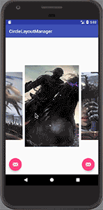

ViewPager-Layout-Manager
======================
A view pager like layout manager with custom ability.

It will handle the recycling under the hood.
All you need to concern about is which the property you want to change and how it change accroding to the scroll offset.

  
 

## Usage

### Gradle

if you want custom your own layout manager please add code below:

```Java
compile 'rouchuan.viewpagerlayoutmanager:viewpagerlayoutmanager-core:1.2.0'
```
or if you want use the effect above please import(No need to import core):

```groovy
compile 'rouchuan.viewpagerlayoutmanager:viewpagerlayoutmanager-support:1.0.0'
```

### Attention!!!

#### Make sure that your item view has the same width and height


### Enable springback

```Java
recyclerView.addOnScrollListener(new CenterScrollListener());
```

### OnPageChangeListener

Only wrok when enabling springback or you need to implement your own OnScrollListene.

```java
mLayoutManager.setOnPageChangeListener(new ViewPagerLayoutManager.OnPageChangeListener() {
            @Override
            public void onPageSelected(int position) {
                
            }

            @Override
            public void onPageScrollStateChanged(int state) {

            }
        });
```


### Enable scrollbars

same as recyclerView

```xml
 <android.support.v7.widget.RecyclerView
        android:scrollbars="horizontal"
        android:id="@+id/recycler"
        android:layout_width="match_parent"
        android:layout_height="match_parent" />
```

### Endless Scroll

```java
viewPagerLayoutManager.setEnableEndlessScroll(true);
```




## Customize

### Default Properties

```Java
protected Context context;

// Size of each items
protected int mDecoratedChildWidth;
protected int mDecoratedChildHeight;

protected int startLeft; //position x of first item
protected int startTop; // position y of first item
protected float offset; //The delta of property which will change when scroll

protected float interval; //the interval between each items
```
### Consturct

By default there are two constructs.mShouldReverseLayout determine the way how each items align

```Java
//Default pass mShouldReverseLayout true
public CustomLayoutManager(){
    this(true);
}

public CustomLayoutManager(boolean mShouldReverseLayout) {
    this.mShouldReverseLayout = mShouldReverseLayout;
}
```

### Methods must be implemented.

It will set the interval of each items.
Once it was set you can use the variable interval directly

```Java
protected abstract float setInterval();
```

You can set up your own properties or change the default properties like startLeft and startTop here

```Java
protected abstract void setUp();
```

You can set item's properties which is determined by target offset here 

```Java
protected abstract void setItemViewProperty(View itemView,float targetOffset);
```

### Methods you can override.

The max offset value of which the view should be removed

```Java
protected float maxRemoveOffset(){
    return getHorizontalSpace() - startLeft;
}
```

The min offset value of which the view should be removed

```Java
protected abstract minRemoveOffset(){
    return -mDecoratedChildWidth-getPaddingLeft() - startLeft;
}
```

You can calculate and set the postion x of each items here

```Java
protected int calItemLeftPosition(float targetOffset){
    return targetOffset;
}
```

You can calculate and set the postion y of each items here

```Java
protected int calItemTopPosition(float targetOffset){
    return 0;
}
```

Return the property which you want to change while scrolling

```Java
protected float propertyChangeWhenScroll(View itemView){
    return itemView.getLeft()-startLeft;
}
```

It return the (scroll dx / offset);

```Java
protected float getDistanceRatio(){
   return 1f;
}
```


## Things to do

1. ~~support infinite scroll~~
2. optimize performance
3. support indicator
4. support item view with different size
5. support other effects (long term subject)


## License

    Copyright 2016 shenruochuan
    Licensed under the Apache License, Version 2.0 (the "License");
    you may not use this file except in compliance with the License.
    You may obtain a copy of the License at
    
    http://www.apache.org/licenses/LICENSE-2.0
    
    Unless required by applicable law or agreed to in writing, software
    distributed under the License is distributed on an "AS IS" BASIS,
    WITHOUT WARRANTIES OR CONDITIONS OF ANY KIND, either express or implied.
    See the License for the specific language governing permissions and
    limitations under the License.