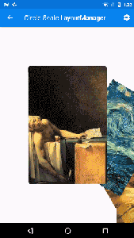
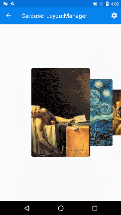
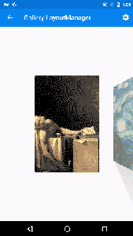
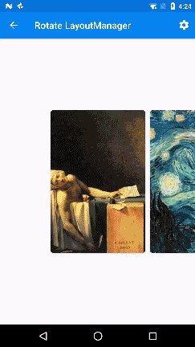
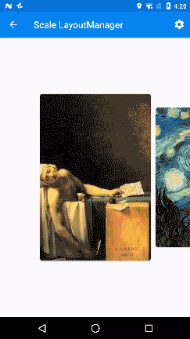

# ViewPager-LayoutManager [ ](https://bintray.com/leochuan/maven/viewpager-layout-manager/_latestVersion) 

[English](README.md) | **中文**


VPLM 实现了一些常见的动画效果，如果你有什么别的想要的效果欢迎给我提ISSUE以及PR

     

## 自定义属性


各个`layoutmanager`都有各自的一些属性可以设置
比如：
* 半径
* 滚动速度
* 间隔
* 排列方向

可以运行下demo看下具体有哪些属性可以设置

## 循环列表


## 自动回滚


可通过给recyclerView添加`CenterScrollListener`实现
```java
recyclerView.addOnScrollListener(new CenterScrollListener());
```

## 安装

Gradle:

```groovy
repositories {
  jcenter()
}

dependencies {
  compile 'rouchuan.viewpagerlayoutmanager:viewpagerlayoutmanager:2.0.1'
}
```

Maven:

```xml
<dependency>
  <groupId>rouchuan.viewpagerlayoutmanager</groupId>
  <artifactId>viewpagerlayoutmanager</artifactId>
  <version>2.0.1</version>
  <type>pom</type>
</dependency>
```

## 快速开始

使用前请确保每一个`view`的大小都相同，不然可能会发生不可预料的错误。


你可以通过新建一个`Builder`来设置各种属性:

```java
new CircleLayoutManager.Builder(context)
                .setAngleInterval(mAngle)
                .setMaxRemoveAngle(mMaxRemoveAngle)
                .setMinRemoveAngle(mMinRemoveAngle)
                .setMoveSpeed(mSpeed)
                .setRadius(mRadius)
                .setReverseLayout(true)
                .build();
```

或者只是简单的调用一下预设的构造方法:

```java
new CircleLayoutManager(context);
```

## License

Apache-2.0. 详情见 [LICENSE](LICENSE)